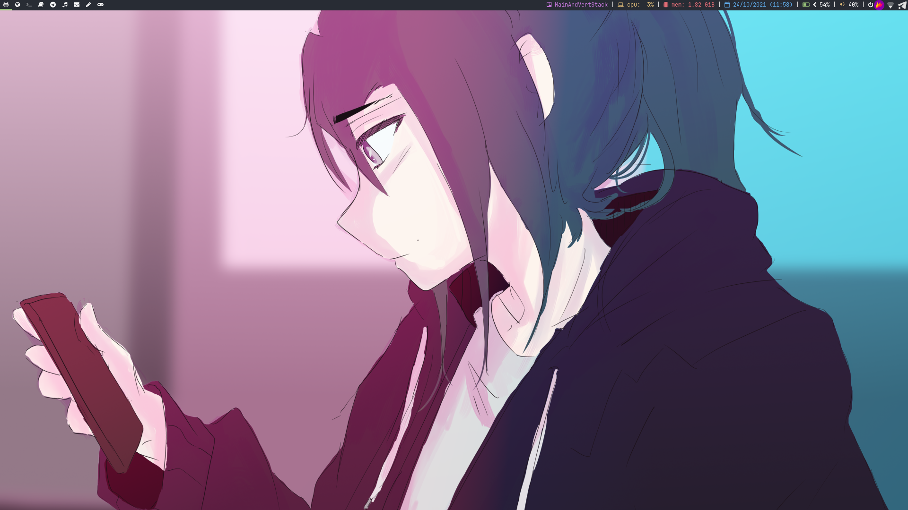
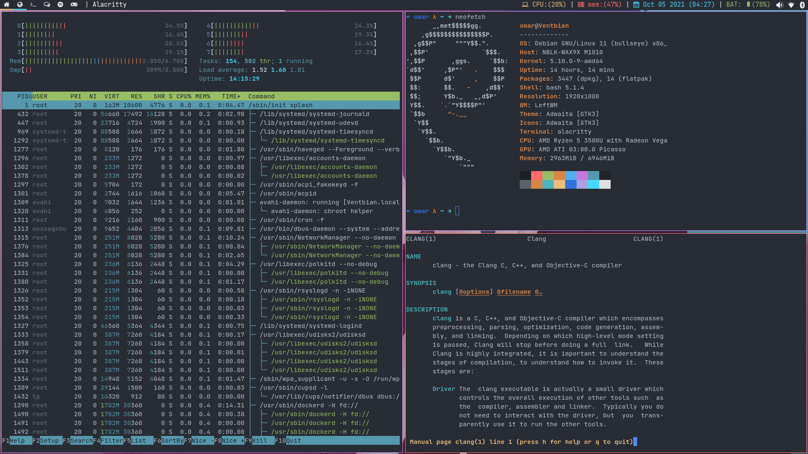
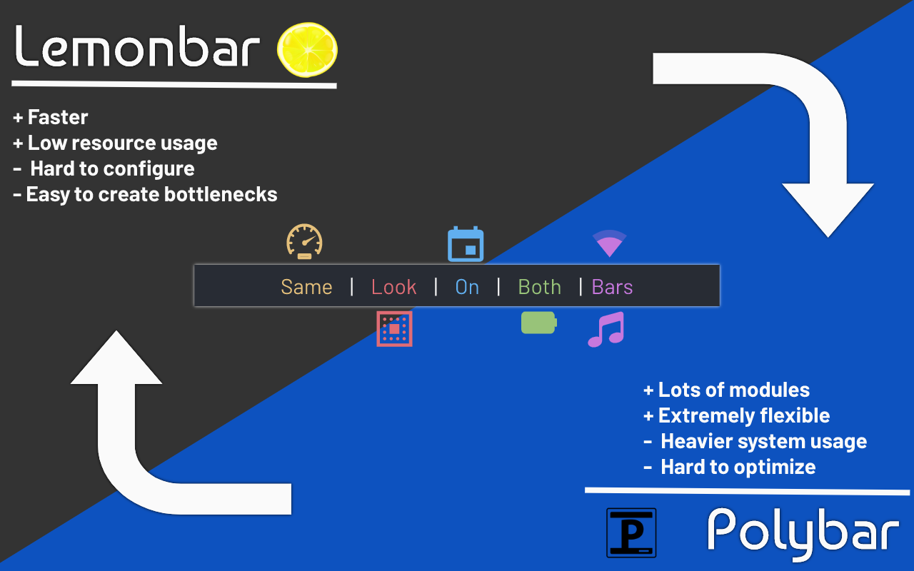

  <h1>🪦 Epitaph 🕊</h1>
  <h2>Confusion will be my epitaph. As I crawl a cracked and broken path</h2>

Complete theme for LeftWM. Epitaph is being developed as a starting point
for Gnu/Linux :penguin: users who are transitioning from a complete Desktop Environment to a minimalist WM, this theme does not
aim to be "simple" or "minimalistic", it aims to be complete and user friendly while keeping
modularity at first.

> For credits and copyright see the bottom of this file.

## News :newspaper:

- Added 5 brand new wallpapers, with prog rock references :D
- Removed lock script
- Handle power menu from dbus in case our system doesn't use systemd
- Made lemonbar update tresholds higher to prevent high CPU usage

## Installation

Installation instructions can be found on the [wiki](https://github.com/VentGrey/Epitaph/wiki)

## Screenshots

### Vanilla look

### dmenu + app list (only .desktop files)

### "productive" screenshot

## Overview

This configuration includes:
- POSIX shell `up` and `down` scripts for fast loading / reloading times
- Simple animations on windows powered by picom
- A simple `dmenu` application menu with icons
- A lot of script / program goodies for dmenu and leftwm!
- Superfast lemonbar
- Polybar / Lemonbar indicators for:
  - CPU use percentage (Polybar only)
  - Memory use in GiB (Polybar only)
  - Calendar + Hour in a simple format
  - Battery / AC Adapter indicator
  - Pulseaudio indicator
  - Music indicator (Polybar Only)
  - SSID indicator (Lemonbar Only)
  - Systray (Polybar Only)
- Doom One colorscheme (Taken from DT's [xmobar config](https://gitlab.com/dwt1/dtos-configs/-/blob/main/etc/skel/.config/xmobar/xmobarrc))
- Very tiny rust power manager
- An integrated script for wallpaper slideshows

# Polybar / Lemonbar switching

> (Also yes, this is a King Crimson reference)

## Credit / Sources

Built on top of [Blue Coffee](https://github.com/Qwart376/Blue-Coffee) theme by @Qwart376.

And some inspiration / patches taken from these wonderful sources:

- @Suavesito-Olimpiada [dotfiles](https://github.com/Suavesito-Olimpiada/dotfiles) - No license but author [states](https://github.com/Suavesito-Olimpiada/dotfiles/blob/master/README.md?plain=1#L26) that his code can be used free as in freedom.

- @AethanFoot [leftwm-theme-dracula-rounded](https://github.com/AethanFoot/leftwm-theme-dracula-rounded) - No license as well. Author doesn't state permissions on code, will update as neccessary.

### Lemonbar programs credits / licenses

*All external programs retain their respective copyright notices*

- Both `battery.rs` and `time.c` programs are written by me and you can use them under the terms of the GPL-v2 ONLY.
- The `getvol.c` program is written by hvod2000. This has no license file but it's a public repository, will assume "UNLICENSE" here.

## Wallpaper artists credit

- Battery 0% was made by lowelllewolfe, please support her work by giving her a :heart: [here](https://www.instagram.com/lowelllewolfe/)
- The Orchid wallpaper is a personal modification I made based on the "Orchid" album from the band *Opeth*
- Erina the cat was made by AreliDrews.
- All of the other wallpapers can be used freely with proper attribution to original sources (not me, the ones below this notice)

## Other Copyright Notices

This software name and pictures don't intend to infringe copyright laws by illegally copying or claiming content that is not mine. This is made solely as a tribute to the band(s) I love and listen to, the original idea + artwork concept and registered trademarks are property of the bands mentioned below and their registered trademark holders.

Some bands that inspired this work are:
- King Crimson (In The Court Of The Crimson King - 1969)
- Camel (Mirage - 1974)
- Opeth (Orchid - 1995)

Emojis used in the wallpapers are the googlefonts/noto-emoji project. Which it's under the Apache License 2.0
